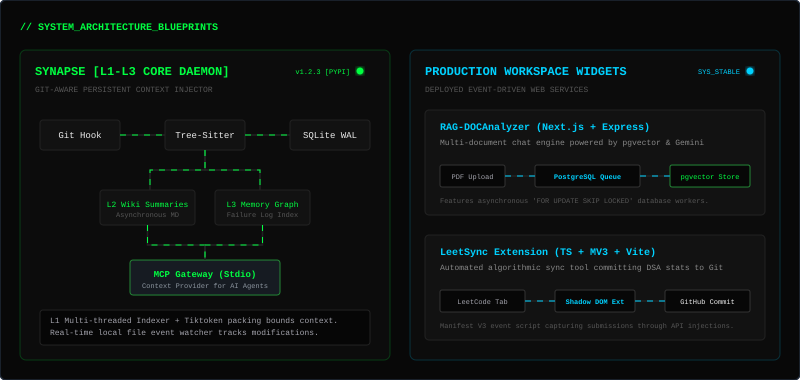

# Sahil Pal



---

### [SYS_DIAGNOSTICS]
```
[DAEMON] Status: ACTIVE (Online since August 2024)
[ROLE] Software Engineer & Context Infrastructure Builder
[ACADEMIC] BCA Student @ Kristu Jayanti College, Bengaluru (2023 - 2026)
[FOCUS] Context Engineering, Asynchronous Systems & AST Parsing
```

---

## 📡 Telemetry Console

This terminal displays verified daemon parameters, status nodes, and local configuration templates.


---

## 🛠️ Capability Index & Technology Stack

The matrix mapping below displays verified runtime capabilities, systems, databases, and frameworks.



---

## ⚡ System Architecture Blueprints

Interactive flow diagrams charting data propagation across core projects and background worker pipelines.



---

## 📂 Core Engines

### 1. [Synapse Engine](https://github.com/saahilpal/synapse) (Flagship)
**Git-aware persistent context injector for AI coding agents.**
Synapse is a local-first system daemon written in Python that mirrors Git state in real-time to inject exact, token-bounded codebase structural boundaries into LLM coding contexts.

[](https://pypi.org/project/synap-git/)
[](https://pypi.org/project/synap-git/)
[](https://github.com/saahilpal/synapse/actions)

*   **L1 (Structural Graph):** Multi-threaded Tree-sitter parser that resolves imports and symbols into an SQLite dependency graph.
*   **L2 (Semantic Wiki):** Asynchronous background worker that structures markdown summaries of files and modules.
*   **L3 (Behavioral Memory):** Stored checkpoints, technical decisions, and failure lessons that persist through branch switches.
*   **Tiktoken Context Packing:** High-performance tokenizer integration prioritizing local graph context within budget limits.
*   **MCP Integration:** Serves code-graph context and memory states directly to coding agents via stdio.

---

### 2. [RAG-DOCAnalyzer](https://github.com/saahilpal/RAG-DOCAnalyzer)
**Chat-first document Q&A workspace.**
A chat-first workspace built with Next.js, Express, PostgreSQL (`pgvector`), and Google Gemini.
*   **Ingestion Pipeline:** Integrates Multer uploads, SHA-256 file deduplication, and Supabase Storage buckets.
*   **PostgreSQL Queue:** Designed a resilient async worker queue utilizing `FOR UPDATE SKIP LOCKED` for lock-free job extraction.
*   **Vector Search:** Implements grounded pgvector cosine similarity search with fallback to PostgreSQL full-text search.

---

### 3. [LeetSync](https://github.com/saahilpal/LeetSync)
**Chrome extension for automated repository synchronization.**
A Manifest V3 Chrome extension built with TypeScript and Vite that captures LeetCode submissions and syncs them automatically to Git.
*   **DOM Capture:** Intercepts code payloads and problem complexity directly within the LeetCode active tab via popup + Shadow DOM injection.
*   **contents API Sync:** Pushes structured Markdown folders directly to target GitHub repositories, automating daily workflow loops.

---

## 🌌 Contribution Galaxy


---

## 📊 Developer Metrics
```
[STATISTICS]
-> Followers   : 2 (early stage)
-> Repositories : 20 Public
-> Achievements: Pull Shark (x2), YOLO
```

[](https://github.com/saahilpal)

---

## 📡 Terminal Connect
*   **Web Portfolio:** [sahil-pal-portfolio-d147.vercel.app](https://sahil-pal-portfolio-d147.vercel.app/)
*   **LinkedIn:** [linkedin.com/in/sahiilpal](https://www.linkedin.com/in/sahiilpal)
*   **PyPI Package:** [pypi.org/project/synap-git/](https://pypi.org/project/synap-git/)
*   **LeetCode:** [leetcode.com/u/saahilpal17/](https://leetcode.com/u/saahilpal17/)
