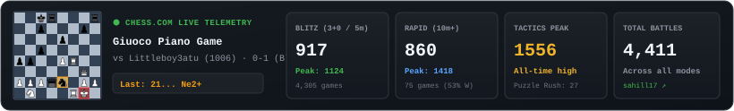

# Sahil Pal

**AI & Backend Systems Engineer** • Bengaluru, India  
[Portfolio](https://sahil-pal-portfolio-d147.vercel.app/) • [LinkedIn](https://linkedin.com/in/sahiilpal) • [Hugging Face](https://huggingface.co/saahilpal17) • [Email](mailto:sahil.sp.sp.2003@gmail.com)

---

I build backend systems, context engines for AI coding agents, and evaluation infrastructure.

I care about low latency, verifiable invariants, local-first execution, and keeping systems free-tier friendly without unnecessary bloat or cloud bills.

---

### 🛠️ What I've Built

#### [Synapse](https://github.com/saahilpal/synapse) *(Favorite)*
> **Git-aware AST code-graph engine & Model Context Protocol (MCP) server for AI coding agents.**

* **Tree-sitter AST Parsing:** Indexes symbols, call graphs, and definitions across repos, achieving **85.2% token context reduction** compared to dumping raw files into agent prompts.
* **SQLite WAL + FTS5:** Sub-token full-text code search operating at **2.1 ms P95 latency**.
* **Blast-Radius Centrality:** Recursive CTE graph traversal (**0.8 ms P95**) combined with Personalized PageRank to rank impacted files and functions before an agent writes a diff.
* **Zero Cloud Footprint:** Runs 100% locally on device with zero external API calls or telemetry.

#### [PropEval](https://github.com/saahilpal/propeval) · [*Laya Training*](https://github.com/saahilpal/propeval-laya-training)
> **Production Hinglish voice AI eval & regression workbench for Indian real estate sales.**

* **Dual-Engine Cascade:** Sub-millisecond fine-tuned Laya System-1 classifier (**<0.4 ms CPU SLA**, 92.1% resolution rate, $\kappa = 0.9912$) resolving routine turns before escalating to an LLM System-2 judge.
* **PostgreSQL 17 Queue:** High-concurrency `SKIP LOCKED` worker coordination with transactional turn commits and strict budget reservation fencing.
* **Paired Statistical Rigor:** Layered hypothesis testing with McNemar + Newcombe Method 10 ($K=1$), and Wilcoxon signed-rank + 10,000-sample Two-Stage Cluster Bootstrap ($K>1$).
* **158 Tests Passing:** Comprehensive test suite covering deterministic FSM buyer simulation, 8 kHz telephony ASR confusion matrices, and budget normalizers.

#### [Disha AI](https://github.com/saahilpal/disha-ai)
> **Chronic condition lifestyle health coach for hypertension & diabetes grounded in ICMR & NIN guidelines.**

* **Full-Duplex Audio:** WebSocket streaming audio with client-side Voice Activity Detection (VAD) for natural turn-taking.
* **RRF Hybrid Search:** Reciprocal Rank Fusion combining PostgreSQL `tsvector` full-text search and `pg_trgm` trigram fuzzy matching across clinical meal and biomarker databases.
* **Deterministic Emergency Breaker:** Sub-millisecond Aho-Corasick pattern matcher detecting clinical red flags (hypertensive crisis, severe angina) to bypass LLM generation and redirect immediately to emergency care.
* **Production Deployment:** Containerized FastAPI backend with Alpine NGINX reverse proxy.

#### [RAG-DOCAnalyzer](https://github.com/saahilpal/RAG-DOCAnalyzer)
> **Full-stack technical document analysis platform with vector semantic retrieval.**

* **pgvector HNSW Search:** Cosine similarity retrieval (`vector_cosine_ops`) paired with an automatic fallback circuit to PostgreSQL full-text search when embedding models degrade.
* **Deduplicated Ingestion:** Asynchronous database-driven worker queue for PDF processing with SHA-256 hash deduplication and page-level chunking.
* **Streaming Architecture:** Real-time Server-Sent Events (SSE) streaming responses from Next.js 16 frontend through Express 5 API.

---

### 🧰 Tech I Work With

| Layer | Technologies & Tools |
| :--- | :--- |
| **Languages** | Python, TypeScript, SQL (PostgreSQL, SQLite), JavaScript |
| **Backends & Systems** | FastAPI, Express 5, Next.js 16, Node.js, Alpine NGINX, Docker Compose |
| **Databases & Search** | PostgreSQL 17 (`pgvector`, `tsvector`, `pg_trgm`), SQLite (WAL, FTS5), Redis |
| **AI & Eval Engines** | Model Context Protocol (MCP), Tree-sitter AST, Paired Hypothesis Testing (McNemar, Wilcoxon, Bootstrap) |
| **Protocols & Telemetry** | WebSocket full-duplex, Server-Sent Events (SSE), OpenTelemetry / Jaeger |

---

### ♟️ Off the Clock

When I'm not writing code or reading about distributed backends, I usually play blitz on Chess.com. Here is my live telemetry synced daily:

  

---

### 📬 Connect

* **Portfolio:** [sahil-pal-portfolio-d147.vercel.app](https://sahil-pal-portfolio-d147.vercel.app/)
* **GitHub:** [saahilpal](https://github.com/saahilpal)
* **LinkedIn:** [sahiilpal](https://linkedin.com/in/sahiilpal)
* **Hugging Face:** [saahilpal17](https://huggingface.co/saahilpal17)
* **Chess.com:** [sahill17](https://www.chess.com/member/sahill17)
* **Email:** [sahil.sp.sp.2003@gmail.com](mailto:sahil.sp.sp.2003@gmail.com)
